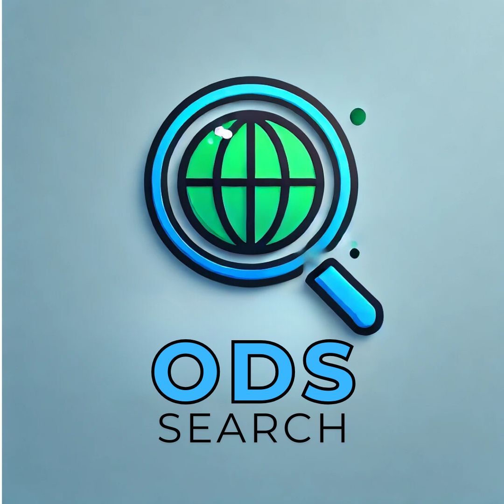

# 🔍 ODS Search 🔍

<H2> <kbd>🚧 EM DESENVOLVIMENTO 🚧</kbd>  

<table>
  <tr>
    <td>
      
    </td>
    <td>
      - ✔️ Projeto da disciplina de Programação Web Front-end   
      - ✔️ Objetivo: Implementar um buscador de ONG's para a cidade de Cornélio Procópio e região (Norte do Paraná).
    </td>
  </tr>
</table>

## 🧠 Integrantes do Grupo

| Nome                           | RA      | GitHub                                          |
| ------------------------------ | ------- | ----------------------------------------------- |
| Allan Vinicios Ferraz Santos   | 2465272 | [alllanvfs](https://github.com/alllanvfs)       |
| Fabio Eizo Rodriguez Matsumoto | 2475413 | [devFabioMats](https://github.com/devFabioMats) |

## ✔️ ODS selecionado

- Nosso projeto não escolheu nenhuma ODS em especifico, pois terá a função de ser um buscador de ODS.

## ℹ️ Descrição do Projeto

- É uma plataforma web que permite aos usuários encontrar organizações não-governamentais (ONGs) com base em temas específicos de interesse. Através de um simples campo de busca, o usuário pode digitar palavras-chave, como "cachorro", "meio ambiente", "educação" ou "saúde", e o sistema irá filtrar as ONGs que estão diretamente relacionadas a esses temas, de acordo com os Objetivos de Desenvolvimento Sustentável (ODS) que elas atendem.

- O objetivo principal deste projeto é conectar pessoas e organizações com causas que mais importam para elas, promovendo o apoio a ONGs que trabalham de forma alinhada aos ODS da ONU. A plataforma busca facilitar a descoberta de ONGs e ajudar na criação de parcerias para iniciativas de impacto social.

## ⚙️ Estrutura do projeto

- A estrutura do projeto é organizada de forma modular, utilizando as melhores práticas de desenvolvimento web. O código está dividido em várias camadas que facilitam a manutenção e escalabilidade da aplicação.

- **/src/**: Contém o código fonte da aplicação:
  - **/images/**: Contém imagens, ícones e outros arquivos de mídia utilizados na interface do usuário.
  - **/pages/**: Contém a parte HTML, responsável pela estrutura da aplicação.
  - **/styles/**: Contém os arquivos CSS que definem a estilização e o layout do projeto.
  - **/scripts/**: Contém os arquivos JavaScript responsáveis pela interatividade da aplicação.
- **README.md**: Este arquivo, que descreve o projeto, suas funcionalidades e a estrutura do código.
